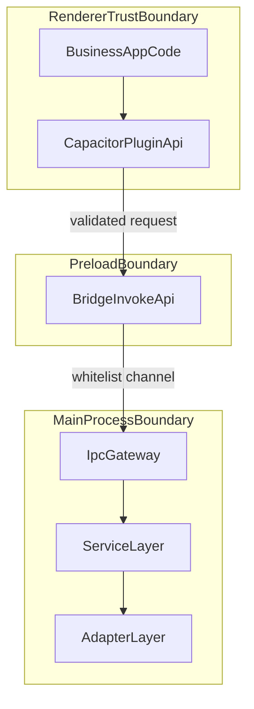

# 01 架构与分层设计

## 目标

本文件用于定义 `@synra/capacitor-electron` 的实现骨架，确保从零实现时具备以下能力：

- 与 Capacitor 插件语义一致的调用体验。
- Electron 多进程场景下的最小信任面与可审计边界。
- 对未来 Electron/Capacitor 版本升级的可控演进能力。
- 可测、可回滚、可开源协作的工程结构。

## 架构主线


## 进程边界与信任边界



边界规则：

- `Renderer` 视为不可信输入来源，任何参数都必须校验。
- `Preload` 只暴露受限调用入口，不暴露 Electron 原生对象。
- `Main` 负责最终授权与执行，任何能力访问都在此收敛。

## 分层职责

### 1) API 层（`src/api`）

- 对外暴露类型安全的插件 API（Promise 语义）。
- 承担输入参数组装、默认超时设置、返回值包装。
- 不直接使用 Electron API，不感知 IPC 细节。

### 2) Preload Bridge 层（`src/bridge/preload`）

- 通过 `contextBridge.exposeInMainWorld` 暴露单一调用入口。
- 负责请求序列化、schema 校验、requestId 注入。
- 仅允许访问固定 channel 白名单。

### 3) Main Gateway 层（`src/bridge/main`）

- 统一注册 `ipcMain.handle`，按方法分发 handler。
- 执行鉴权策略、错误归一、超时与取消控制。
- 输出结构化日志（method、requestId、durationMs、status）。

### 4) Service 层（`src/host/services`）

- 实现业务能力（如 runtimeInfo、外链打开、文件读取）。
- 聚焦业务规则，不耦合 IPC 协议细节。
- 通过接口注入依赖，便于单元测试替换。

### 5) Adapter 层（`src/host/adapters`）

- 封装 Electron/Node 原生 API 调用。
- 处理平台差异（Windows/macOS/Linux）与版本兼容。
- 作为安全开关的最终执行点（路径白名单、权限判定）。

### 6) Shared 层（`src/shared`）

- 存放协议模型、错误码、channel 常量、schema 与工具函数。
- 保持纯函数与纯类型，避免副作用。

## 依赖方向与约束

- 允许：`api -> bridge/preload -> bridge/main -> services -> adapters`。
- 允许：`all layers -> shared`。
- 禁止：`services -> bridge`、`api -> services`、`adapters -> api`。
- 禁止：绕过统一 invoke 管道直接建立新 IPC 入口。

## 生命周期设计

### 初始化

1. Main 进程创建窗口并设置安全默认（`contextIsolation: true`、`nodeIntegration: false`）。
2. Main 注册桥接 handler（只注册一次，支持幂等检查）。
3. Preload 暴露桥接 API（单一 `invoke`）。
4. Renderer API 执行能力探测与协议版本协商。

### 运行

- 所有请求都带 `requestId`、`protocolVersion`、`method`。
- Gateway 记录请求起止时间并输出可聚合日志。
- 长任务必须支持取消（`AbortSignal` 或 token 机制）。

### 退出

- Main 进程清理监听器、定时器和挂起任务。
- 进行中的任务在超时或退出时统一回收。

## 失败恢复策略

- 协议不匹配：返回 `UNSUPPORTED_OPERATION` 与可支持版本。
- 参数非法：返回 `INVALID_PARAMS`，拒绝执行。
- 系统级异常：映射为 `INTERNAL_ERROR`，不透传底层堆栈。
- 可重试错误：在 `details` 标注 `retryable`，由上层决定重试。

## 安全默认策略

- 强制 `contextIsolation: true`、`sandbox: true`（如宿主约束允许）。
- 禁止在 `Preload` 暴露 `ipcRenderer`、`shell`、`fs` 等原生对象。
- Channel 采用显式前缀与版本（示例：`synra:cap-electron:v1:invoke`）。
- 请求与响应都经过 schema 校验，校验失败直接拒绝。
- 对路径、URL、命令参数执行白名单或策略校验。

## 目录建议

```text
src/
  api/
    plugin.ts
    methods/
  bridge/
    preload/
      expose.ts
      invoke.ts
    main/
      register.ts
      dispatch.ts
      handlers/
  host/
    services/
      runtime-info.service.ts
      external-link.service.ts
      file.service.ts
    adapters/
      electron-shell.adapter.ts
      file-system.adapter.ts
  shared/
    protocol/
    errors/
    schema/
    observability/
  index.ts
```

## 范围说明

范围内：架构、分层、边界、生命周期、安全默认策略。  
范围外：具体 API 字段定义与协议示例（见 `02`）、性能与发布策略（见 `03`）、执行里程碑（见 `04`）。
