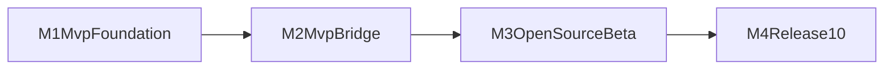

# 04 实施路线图

## 总体策略

采用“协议先行 -> 主链路可用 -> 开源 Beta -> 1.0 稳定发布”的推进策略。  
每个里程碑必须具备四类交付：代码、文档、测试、发布准备。

## 阶段拆分总览

## 里程碑 M1：MVP 基础层（协议与工程骨架）

### 目标

- 将现有模板包改造为可承载 Electron 插件实现的工程结构。
- 固化协议模型、错误码、channel 规范。
- 建立最小可运行测试与 CI 验证路径。

### 输出物

- `src/api`、`src/bridge`、`src/host`、`src/shared` 基础目录。
- 协议类型定义与 schema。
- 统一 `invoke` 调用管道的空实现。
- 基础测试（协议解析、错误映射、版本协商）。

### 验收标准

- 能通过 `vp check`、`vp test`。
- 有最小 API 可调用并返回 mock 数据。
- 文档 `02` 与 `03` 中的术语、字段命名与代码结构一致。

### 风险与回滚

- 风险：目录调整影响现有导出。
- 回滚：保留 `index.ts` 兼容导出层，内部渐进迁移。

## 里程碑 M2：MVP 主链路（Preload + Main + Service）

### 目标

- 打通 WebView -> preload -> ipc -> main -> service 的主调用链路。
- 落地最小能力集合并验证安全默认。

### 输出物

- preload 暴露层与 main 注册中心。
- 最小 handler 集合（`runtime.getInfo`、`external.open`、`file.read`）。
- requestId 链路日志。
- 失败映射（`INVALID_PARAMS`、`TIMEOUT`、`INTERNAL_ERROR`）。

### 验收标准

- 最小 demo 可在 Electron 中完成至少 2 个 API 调用。
- 错误场景可返回稳定错误码。
- 安全基线生效（单一 invoke、channel 白名单、输入校验）。

### 风险与回滚

- 风险：安全配置不当导致暴露面过大。
- 回滚：通过单一 `invoke` 入口与白名单机制收敛。

## 里程碑 M3：开源 Beta（兼容矩阵与文档完备）

### 目标

- 形成可公开试用的 Beta 版本。
- 建立兼容矩阵和测试矩阵，保证跨平台可验证。
- 完成迁移与使用文档，降低外部接入成本。

### 输出物

- 稳定 API 子集与能力说明。
- 协议版本协商机制与弃用声明模板。
- 集成测试矩阵（OS x Electron x Capacitor）。
- `README` 与 `checklist` 对外可执行。

### 验收标准

- 新增 API 均有类型、schema、测试。
- 兼容矩阵中标记为 supported 的组合全部通过验证。
- 至少一份最小示例可跑通核心 API。

### 风险与回滚

- 风险：对外 API 过早冻结导致后续演进受限。
- 回滚：Beta 期间通过 `experimental` 标记保留调整空间。

## 里程碑 M4：1.0 发布（稳定性与治理）

### 目标

- 达成性能预算并完成 1.0 发布条件。
- 将工程治理要求固化为可持续维护流程。

### 输出物

- 性能基线报告（冷启动、IPC 延迟、吞吐）。
- 发布检查流程（`vp check`、`vp test`、`vp pack`）。
- 版本策略与 breaking change 说明模板。
- 1.0 迁移说明与示例工程。

### 验收标准

- 性能指标达到 `03-modern-stack-and-performance.md` 目标范围。
- 发布包结构、类型导出、运行验证通过。
- 对外文档可独立指导安装、接入、排障与升级。

### 风险与回滚

- 风险：优化过程中破坏 API 稳定性。
- 回滚：协议版本化 + feature flag 灰度。

## 并行推进建议

- 协议与测试规范可先并行推进。
- 主进程能力适配与 API 封装可按模块并行。
- 所有并行开发分支都需对齐同一协议版本文档。

## 时间建议（可调整）

- M1：1 周
- M2：1~2 周
- M3：2 周
- M4：1 周

## 完成定义（Definition of Done）

- 对外 API、协议、错误码、兼容矩阵均有文档与测试。
- 关键路径性能满足 `04` 的默认预算。
- 有可运行示例并通过基础 CI 检查。
- 1.0 版本具备明确升级说明与变更记录。

## 范围说明

本路线图仅覆盖 `@synra/capacitor-electron` 的宿主桥接与能力实现。  
跨端通讯与插件运行时路线图已迁移到 `ai-docs/main/roadmap.md`。
