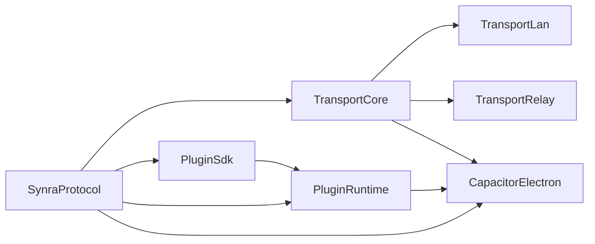

# 08 Packages 拆分方案（@synra 命名空间）

## 目标

围绕“跨端协议 + 通讯 + 插件运行时 + Electron 宿主”进行完全模块化拆分，降低耦合并支持独立发布。

## 命名规范

- 所有库统一使用 npm 组织：`@synra/*`
- 目录建议使用无作用域短名（如 `packages/protocol`），`package.json` 中使用作用域全名。

## 包列表与职责

## 1) `@synra/protocol`

- 定义跨端消息协议、错误码、schema、事件类型。
- 被 transport、plugin runtime、electron host 共同依赖。

## 2) `@synra/transport-core`

- 传输抽象接口、连接状态机、ACK/重试/幂等工具。
- 不依赖具体网络实现。

## 3) `@synra/transport-lan`

- 实现局域网发现、直连、保活。
- 依赖 `@synra/transport-core` 与 `@synra/protocol`。

## 4) `@synra/transport-relay`

- 实现中继连接、鉴权、消息转发。
- 依赖 `@synra/transport-core` 与 `@synra/protocol`。

## 5) `@synra/plugin-sdk`

- 提供插件接口、动作定义、配置模型。
- 面向插件作者使用。

## 6) `@synra/plugin-runtime`

- 插件注册中心、匹配编排、冲突处理、执行回执。
- 依赖 `@synra/plugin-sdk`、`@synra/protocol`。

## 7) `@synra/capacitor-electron`

- Electron 宿主适配：preload/main bridge、PC 动作执行 adapter。
- 依赖 `@synra/protocol`、`@synra/plugin-runtime`、`@synra/transport-core`。

## package.json `name` 与导入示例

建议每个包的 `package.json` 至少明确以下命名：

- `name: "@synra/protocol"`
- `name: "@synra/transport-core"`
- `name: "@synra/transport-lan"`
- `name: "@synra/transport-relay"`
- `name: "@synra/plugin-sdk"`
- `name: "@synra/plugin-runtime"`
- `name: "@synra/capacitor-electron"`

导入示例（供业务与宿主代码参考）：

```ts
import { type SynraCrossDeviceMessage } from "@synra/protocol";
import { createTransportRouter } from "@synra/transport-core";
import { createPluginRuntime } from "@synra/plugin-runtime";
import { createElectronHost } from "@synra/capacitor-electron";
```

## 依赖方向



## 发布策略建议

- 首次发布顺序：`protocol` -> `transport-core` -> `plugin-sdk` -> `plugin-runtime` -> `transport-*` -> `capacitor-electron`
- 语义化版本管理：协议库与运行时库分开升版，避免无意义联动发布。

## 最小化落地顺序

1. 先落地 `@synra/protocol`（统一契约）。
2. 再落地 `@synra/plugin-sdk` + `@synra/plugin-runtime`（业务编排）。
3. 再落地 `@synra/transport-core` + `@synra/transport-lan`（先跑直连）。
4. 然后补 `@synra/transport-relay`（回落能力）。
5. 最后在 `@synra/capacitor-electron` 集成。
