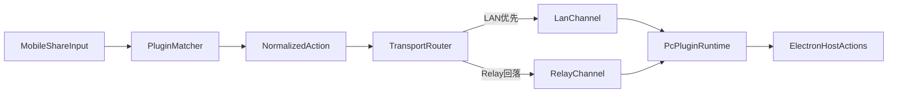

# Synra Capacitor Electron 实现文档

整理日期：2026-04-15

本文档面向 `packages/capacitor-electron` 的重构与实现工作。目标是在不依赖已停更社区方案的前提下，建立一个可持续演进、类型安全、性能可控的 Capacitor + Electron 对接库，并对齐最终跨端产品形态。

## 背景与目标

当前社区仓库 `capacitor-community/electron` 已长期停止维护，且其设计基于较早期 Electron 与 Capacitor 生态。Synra 需要对接最新 Electron 稳定版本，并保持与现有 monorepo（Vite+、Capacitor 工作流）的一致性。

本方案目标：

- 提供面向业务可复用的 `@synra/capacitor-electron` 库。
- 以现代 TypeScript/Electron 实践重建桥接层，而不是直接复制旧实现。
- 在“优雅封装”与“执行性能”之间平衡，保证开发体验与运行质量。
- 为“手机端触发、PC 端执行”的跨端插件化流程提供宿主支撑。

## 文档阅读顺序

1. `01-current-state-analysis.md`：先看当前脚手架现状与缺口。
2. `02-architecture-and-layering.md`：统一分层、职责与边界。
3. `03-api-and-bridge-design.md`：确定 JS API 与 IPC 协议。
4. `04-modern-stack-and-performance.md`：锁定技术选型与性能约束。
5. `05-implementation-roadmap.md`：按里程碑推进落地。
6. `06-cross-device-transport.md`：跨端通讯抽象与回落策略。
7. `07-plugin-runtime-design.md`：插件运行时与执行编排。
8. `08-package-splitting.md`：`@synra/*` 包拆分与边界。
9. `checklist.md`：执行清单与验收标准。

## 作用范围

本目录仅用于“实现设计与执行指导”，不直接承载运行时代码。所有实现代码后续统一落在：

- `packages/capacitor-electron`

同时，跨端协议、通讯、插件运行时会按模块拆分到独立 `packages`，命名统一使用 `@synra/*`。

## 最终产品映射（来自 app 目标）

最终产品核心链路是：

1. 手机侧接收分享内容（文本、链接、文件）。
2. 通过插件匹配器判断是否触发对应插件。
3. 将标准化动作请求通过跨端通讯发送到 PC。
4. PC 侧插件执行器调用 Electron 宿主能力（如打开浏览器、打开文件、模拟快捷键）。

## 外部参考

- 历史社区实现（仅用于调研对比，不直接继承）：[capacitor-community/electron](https://github.com/capacitor-community/electron)

## 设计原则（总览）

- 接口先行：先定义 API 合同与数据模型，再实现桥接层。
- 分层清晰：JS 入口、preload、main、服务层职责分离。
- 稳定优先：Electron 升级时尽量通过适配层收敛变更面。
- 性能有预算：关键路径有指标，避免“跑得通但不可扩展”。
