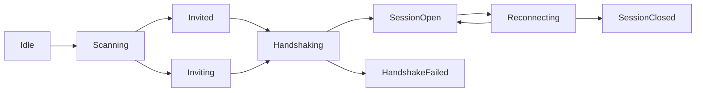

# 网络发现与邀请

## 目标

定义统一的节点发现与建连流程，确保移动端与客户端具备等价能力。

## 能力要求

- 每个节点都可启动 TCP 服务端监听。
- 每个节点都可作为扫描器进行 LAN 发现。
- 每个节点都可发起邀请并接收邀请确认。
- 建连前必须完成设备身份声明与最小能力交换。

## 发现机制

### Synra LAN（Capacitor / Electron 主机）

- 对同一 `(ip, tcpPort)` 的 Synra 探测与会话复用**一条** TCP：`hello` / `helloAck` 成功后不再为「仅探测」单独关连接，而是进入长度前缀 JSON 读循环并发出 `sessionOpened`（出站）。
- JS 层不应在扫描结束后再对每个可连设备二次 `openSession` 打开第二条 TCP；需要主动连对端时使用 `LanDiscovery.ensureOutboundSession`（或由适配器路由到该方法）。
- **`hybrid` 且 `enableProbeFallback` 为 true（默认）**：mDNS 与 UDP 定向发现候选取**并集**后再做 TCP probe，避免「mDNS 已有其它主机却永远不走 UDP」导致漏扫（例如部分桌面端仅 UDP 响应）。
- **`enableProbeFallback` 为 false**：`hybrid` 下**不**跑 UDP 定向发现，仅 mDNS + 手动目标。

### 后台与多端同步（Synra LAN）

- **Android**：`@synra/capacitor-lan-discovery` 在 TCP 传输栈启动后会启动 **前台服务**（`connectedDevice` 类型），用于在后台仍维持本机 LAN 监听/会话能力；停止 TCP 栈（如 `stopDiscovery` 触发的 teardown）时结束服务。需通知权限与渠道文案随产品调整。
- **iOS**：系统仍会挂起后台应用；前台恢复时由 **`@capacitor/app` + `@synra/hooks`** 在 `appStateChange` 活跃态拉取 `getDiscoveredDevices` 并刷新列表，配合 `pair-awaiting-prune`，减少「必须连扫两次才对齐配对态」的情况。短时后台收尾若需 `beginBackgroundTask`，应在 App 原生层单独接入，不在此文档展开。

## 广播内容

节点周期广播以下信息：

- `nodeId`
- `displayName`
- `tcpListenPort`
- `protocolVersion`
- `clusterHint`（可选）
- `lastKnownTerm`（可选）

## 扫描行为

- 扫描窗口内收集节点广播并更新可达状态。
- 同一 `nodeId` 只保留最新心跳记录。
- 扫描结果按可达性与协议兼容性排序。

## 邀请机制

## 邀请流程

1. 邀请方选择目标节点并发起 `invite.request`。
2. 被邀请方返回 `invite.accept` 或 `invite.reject`。
3. 接受后双方执行握手并建立会话。
4. 会话建立后，成员向当前主机注册连接关系。

## 邀请约束

- 邀请请求必须携带发起者的当前 `term` 认知。
- 被邀请方若发现发起方 `term` 过旧，返回 `TERM_OUTDATED`。
- 被邀请方若处于主机切换窗口，返回 `ELECTION_IN_PROGRESS`。

## 握手与会话建立

## 握手字段

- `nodeId`
- `nonce`
- `protocolVersion`
- `supportedFeatures`
- `observedHostId`
- `observedTerm`

## 握手完成条件

- 协议版本兼容。
- 双方 `nodeId` 不冲突。
- 安全校验通过。
- 至少一个可用业务通道建立成功。

## 连接状态机

## 失败处理

- `INVITE_TIMEOUT`：邀请超时，节点进入重试回退窗口。
- `HANDSHAKE_FAILED`：握手失败，必须清理临时会话上下文。
- `PROTOCOL_INCOMPATIBLE`：协议不兼容，禁止自动重试。
- `DUPLICATE_NODE_ID`：节点身份冲突，拒绝入集群。
