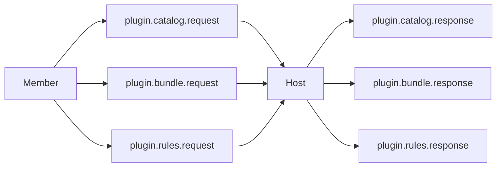

# 插件同步与运行时路由

## 目标

确保集群内插件与规则只有一个权威源，并通过主机完成执行请求路由与回执。

## 权威模型

- 主机维护 `PluginCatalogAuthority`。
- 成员只缓存插件包与规则快照，不直接改写权威版本。
- 所有同步请求都通过主机处理并携带 `term` 与 `epoch`。

## 同步链路

## 同步策略

- 首次入群：全量拉取 `catalog`、`bundle`、`rules`。
- 常态运行：按版本差异增量同步。
- 主机切换后：成员强制执行一次权威快照重建。

## 运行时路由

1. 发起节点向主机发送 `relay.request`。
2. 主机校验目标节点、插件版本与规则版本。
3. 主机转发到执行节点并回传 `relay.ack`。
4. 执行节点返回 `relay.result` 给主机。
5. 主机聚合后回传发起节点。

## 执行状态约束

- `runtime.received`：目标节点已接收并进入执行流程。
- `runtime.started`：动作开始执行。
- `runtime.finished`：动作结束，状态为 `success|failed|cancelled`。
- `runtime.error`：无法进入执行流程的即时错误。

## 一致性约束

- 成员执行动作前必须校验本地插件与规则版本是否匹配主机声明。
- 版本不一致时先请求同步再执行。
- 主机对过期成员返回 `PLUGIN_STATE_STALE`。

## 失败处理

- `PLUGIN_NOT_FOUND`：主机无对应插件。
- `PLUGIN_VERSION_MISMATCH`：成员版本与主机不一致。
- `RULE_VERSION_MISMATCH`：规则版本过旧。
- `HOST_FAILOVER_ABORTED`：主机切换导致请求中断。
