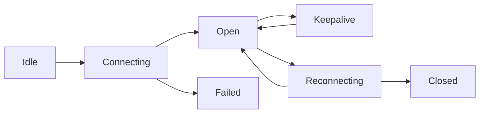

# 会话与传输契约

## 目标

定义统一的 TCP 会话与消息传输规则，保障跨端行为一致与故障可恢复。

## 协议头最小字段

- `messageId`：全局唯一消息 ID。
- `sessionId`：会话 ID。
- `term`：当前任期。
- `epoch`：主机配置版本。
- `fromNodeId`：发送方节点。
- `toNodeId`：接收方节点。
- `type`：消息类型。
- `timestamp`：发送时间戳。
- `payload`：业务载荷。

## 消息类型分组

- 会话类：`session.open`、`session.close`、`session.keepalive`
- 路由类：`relay.request`、`relay.ack`、`relay.result`
- 主机类：`host.announce`、`host.retire`、`host.member.offline`
- 选举类：`election.vote.request`、`election.vote.response`、`election.win`
- 同步类：`plugin.catalog.*`、`plugin.bundle.*`、`plugin.rules.*`
- 错误类：`transport.error`

## 状态机

## 可靠性约束

- `messageId` 幂等：重复消息只处理一次，重复包仅返回历史 ACK。
- ACK 超时重试：仅重试可幂等请求。
- 写入背压：发送队列在高水位触发限流。
- 帧大小上限：超限消息直接拒绝并返回 `FRAME_TOO_LARGE`。
- 成员主动下线时必须先发送 `session.close` 给主机。
- 主机收到成员下线后必须广播 `host.member.offline` 给其他成员。
- 主机主动下线时优先发送 `host.retire`，成员收到后立即进入重选流程。

## 重连策略

- 指数退避重连，设置最大退避上限。
- 重连成功后优先同步主机公告与路由上下文。
- 重连窗口内缓存待发幂等请求，超时后失败回执。

## 错误码

- `SESSION_NOT_FOUND`
- `SESSION_EXPIRED`
- `TARGET_UNREACHABLE`
- `TERM_OUTDATED`
- `HOST_UNAVAILABLE`
- `FRAME_TOO_LARGE`
- `ACK_TIMEOUT`
- `PROTOCOL_INCOMPATIBLE`

## 安全约束

- 会话建立必须经过身份校验与随机挑战。
- 消息需附带完整性校验字段。
- 节点不得接受来源未知的主机公告。
