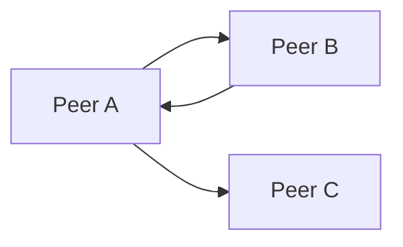

# 点对点直连模型（V2）

## 目标

采用“发现 + 直连”模型，移除业务层主机中继依赖，统一为设备到设备通信。

## 角色定义

- `Peer`：任意设备节点，既可发送也可接收消息。
- `LanDiscovery`：负责 UDP 发现与设备上下线广播。
- `DeviceConnection`：负责 TCP 点对点连接与消息收发（内部维护 session）。
- `Runtime API`：对上只暴露 `sendToDevice / broadcast / onMessage`。

## 核心约束

- 业务层只按 `deviceId` 进行寻址，不处理传输会话细节。
- 发现阶段通过 UDP 广播/监听维护 peer 列表。
- 消息阶段通过 TCP 建立或复用点对点链路。
- 设备下线时主动广播，其他设备据此移除 peer。

## 消息路径

## 路由与可达性

- 路由键：`deviceId`
- 路由值：`ipAddress`、`port`、`lastSeenAt`、`connectable`
- 不可达目标在发送时快速失败并返回错误，由上层决定是否重试
