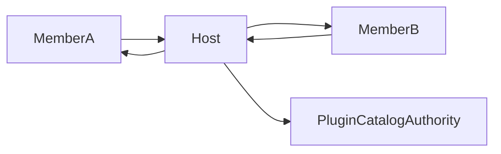

# 单主机中继模型

## 目标

建立单主机中继架构，确保多节点通信路径一致、状态可观测、故障可接管。

## 角色定义

- `Host`：中继路由中心，维护成员路由表与插件权威状态。
- `Member`：通过主机发送与接收业务请求的普通节点。
- `Candidate`：在选举窗口参与竞选的临时角色。

## 核心约束

- 同一 `term` 下只能有一个活跃 `Host`。
- 成员之间不得直接发送业务执行请求。
- 所有业务消息必须经过 `Host` 路由并带有路由追踪标识。
- 插件与规则元数据只能由 `Host` 发布。

## 消息路径

## 中继职责

- 路由：根据目标 `nodeId` 转发请求与回执。
- 仲裁：拒绝非法路径和过期 `term` 消息。
- 同步：向成员分发插件目录与规则版本。
- 聚合：汇总执行状态并返回请求发起者。
- 状态广播：成员主动下线后，向其他成员广播成员离线状态。

## 路由表要求

- 路由表键为 `nodeId`，值包含 `sessionId`、最后心跳、可用通道。
- 节点失联后路由项立即标记为不可达。
- 不可达节点请求返回 `TARGET_UNREACHABLE`。

## 主机切换一致性

- `Host` 切换时必须提升 `term` 与 `epoch`。
- 成员仅接受高于本地认知 `term` 的主机公告。
- 双主冲突时成员保留最高 `term` 主机，低 `term` 主机进入降级流程。
