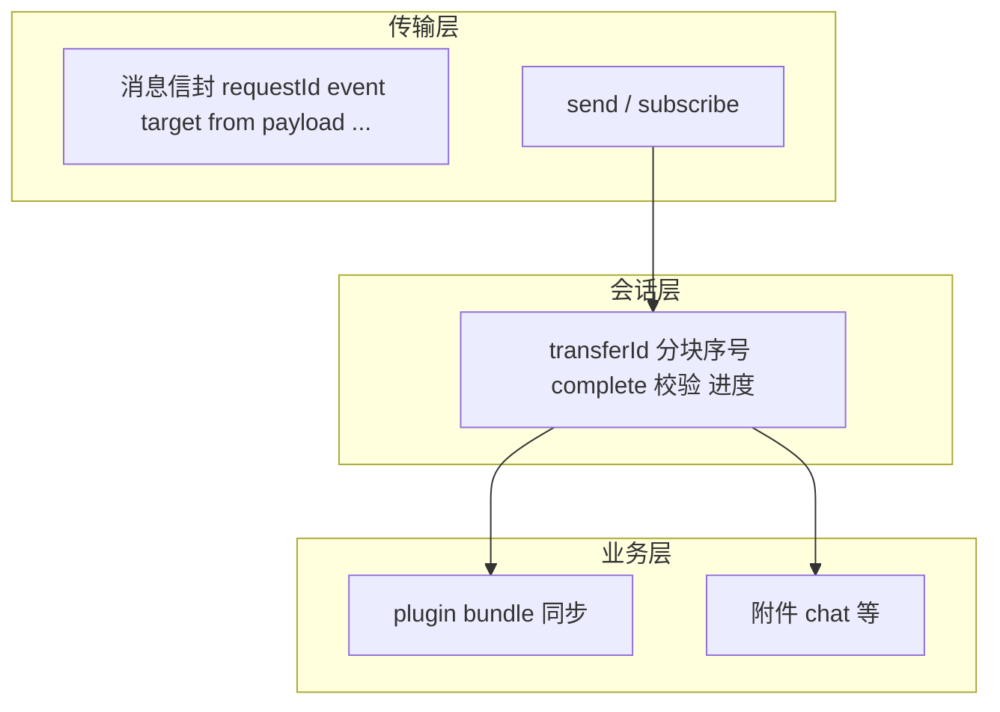

# 分层模型：传输、会话、业务

## 总览

跨设备传文件**不是**新传输通道，而是在**既有连接与消息模型**上增加**有状态的分块会话**。

## 传输层

- **职责**：保证单帧消息按 Synra 约定送达对端；**不**解析「这是第几块文件」。
- **实现形态**：各端现有的连接服务、`capacitor-device-connection` 桥接等；前端栈上最终仍落在 **`useSynraEnvelope`**（及 `useSynraEvent` / `useSynraPluginEvent` 等前缀封装）所驱动的收发路径。
- **约束**：信封字段仍遵守白名单；分块二进制、文件名、hash、`transferId` 等**全部放在 `payload`**。

## 会话层（文件传输封装的核心）

- **职责**：把任意字节流切成多块，按规范 **`file.transfer.*`** 事件发送（见 [04-protocol-events-and-payload.md](./04-protocol-events-and-payload.md)）；接收端重组、校验、`complete` 后交给上层。
- **建议具备**：
  - **`transferId`**：全局区分一次传输；可与 **`syncSessionId`** 等并用以防跨轮混块。
  - **分块元数据**：`chunkIndex`、`totalChunks`；默认 **`chunkBase64`**（见下文「编码」）。
  - **结束语义**：`file.transfer.complete`；**`file.transfer.abort`** 表示异常结束；可选 **`file.transfer.progress`** 作会话级进度。
  - **完整性**：整包 hash 或与 manifest 对齐的校验，在 **complete 后或写盘前**执行。
- **与现有实现**：线上数据面统一为 **`file.transfer.request` / `chunk` / `complete`（及可选 `abort` / `progress`）**；插件包场景在 **`payload.kind === 'plugin-bundle'`** 下携带 `pluginId`、`version`。通用会话状态机与组装逻辑见 **`@synra/protocol`**（`iteratePluginBundleChunks`、`PluginBundleTransferAssembly`）与 **`useFileTransfer`**（`@synra/hooks`）。

## 编码与体积（默认）

- **默认（规范）**：JSON **`payload`** 内使用 **`chunkBase64`**，与 `@synra/protocol` 类型一致。
- **非目标（本文档范围）**：不经 JSON/base64 的独立大对象通道；若将来引入须另文说明，且**不得**扩展信封字段。

## 业务层

- **插件包同步**：`artifactRoot` 下 `package.tgz`（或等价 tar）作为会话字节源；完成后走插件安装与激活路径（见 plugin-system）。
- **插件 SDK 场景**（如 Chat）：在会话 payload 中增加 **`kind: 'attachment'`**（见协议类型）、聊天上下文 id、展示文件名等；**权限与配额**由宿主在调用 SDK API 时强制执行。

## 模块边界（重申）

- **`capacitor-device-connection`**：保持「连接、收发字节/消息」，**不**内置文件业务状态机。
- **会话封装**：宿主侧 bridge、`packages/protocol` 与 **`@synra/hooks`**（`useFileTransfer`）等与 **`packages/protocol`** 类型同步。
- **插件**：通过 **`plugin-sdk`** 暴露高层 API，**不**直接依赖宿主内部 chunk 实现细节。
