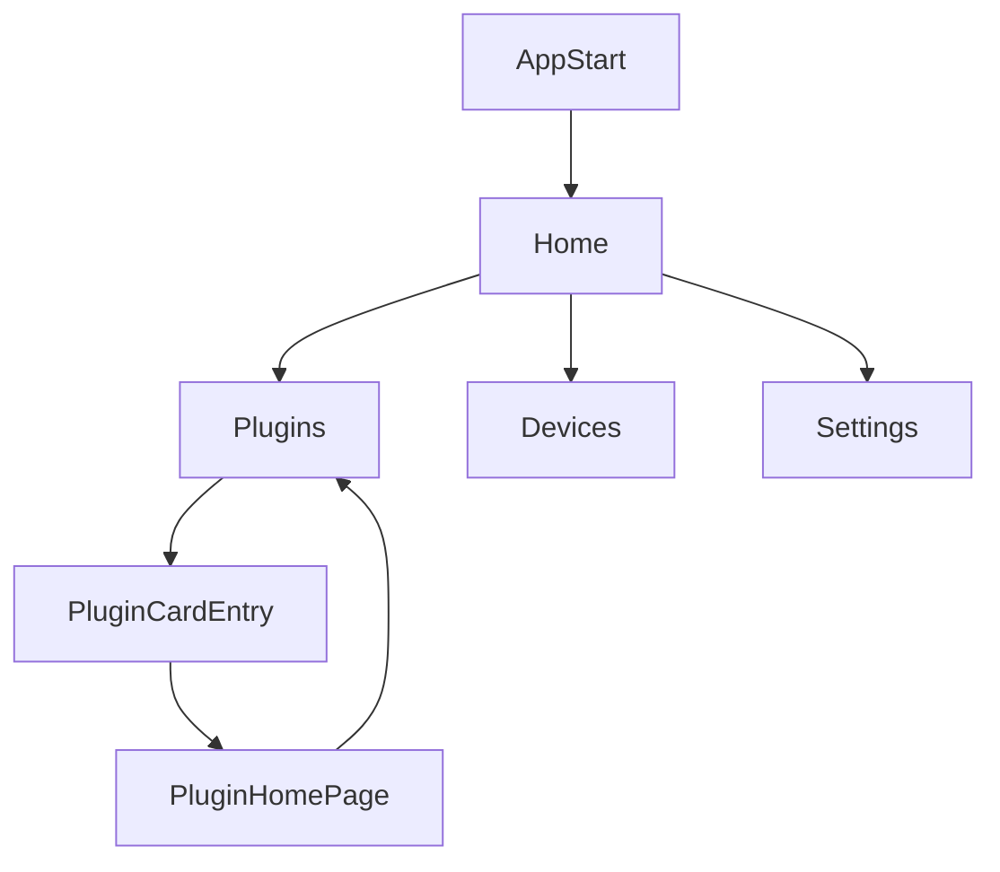

# 信息架构（产品版）

本文档定义产品化前端页面结构，目标是替换 demo 导向叙事，统一为可持续演进的应用信息架构。

## 应用壳层

采用 `LeftSidebar + ContentArea`：

- 左侧：菜单导航（图标 + 名称），支持收缩。
- 右侧：当前页面主内容区。
- 小屏：侧栏降级为抽屉导航，主内容全宽显示。

## 页面层级

```text
SynraApp
├─ Home（主页）
├─ Plugins（插件列表）
├─ Devices（设备）
└─ Settings（设置）
```

## 一级页面职责

### `Home`

- 只承担品牌入口展示。
- 页面内容最小化：
  - 标题：`Synra`
  - 副信息：`version` 一行

### `Plugins`

- 作为插件入口与浏览页。
- 必备元素：
  - 搜索框（首版可仅 UI，不接真实检索逻辑）
  - 插件卡片列表（PC / 移动端自适应列数）
  - 插件图标（优先 `logo.png`，缺失回退 UnoCSS icon）
- 默认展示内置插件 `chat`（状态：已安装）。

### `Devices`

- 延续当前连接与配对能力（扫描、设备列表、配对、连接状态）。
- 页面文案与信息层级按产品语言表达，不暴露 demo/调试导向结构。

### `Settings`

- 保持当前定位：诊断、关于、运行时信息。
- 不承担主业务入口职责。

## 页面流转（当前阶段）



## 路由语义要求

- 顶层路由固定四项：`home`、`plugins`、`devices`、`settings`。
- 前端页面文件命名统一为 `pages/xxx/index.vue`：
  - `pages/home/index.vue`
  - `pages/plugins/index.vue`
  - `pages/devices/index.vue`
  - `pages/settings/index.vue`
- 插件路由由插件机制动态扩展，不写死在应用静态页面列表中。
- 插件动态路由统一加 `plugin-` 前缀：`/plugin-${pluginId}/${pageKey}`（例如 `/plugin-chat/home`）。
- 插件页面进入/退出时的路由注册和注销由插件生命周期驱动（详见后续插件机制文档）。

## 信息优先级

- 第一层：用户当前可执行动作（导航、搜索、连接操作）。
- 第二层：关键状态（安装状态、连接状态、版本）。
- 第三层：诊断与技术细节（仅设置页承载）。
