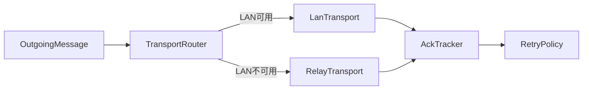

# 跨端通讯设计（LAN 优先 + Relay 回落）

## 目标

为 Synra 提供稳定、可回退、可观测的跨设备通讯能力，满足“手机触发动作，PC 执行动作”的核心链路。

## 设计原则

- 优先低延迟：同网段优先使用 LAN 直连。
- 自动回落：LAN 不可用时切换 Relay，不阻塞业务流程。
- 可靠投递：关键消息具备 ACK、重试、幂等保障。
- 状态可观测：连接状态、切换原因、失败原因可被追踪。

## 模块边界

- `@synra/transport-core`
  - 定义 `DeviceTransport` 接口、连接状态机、重试策略、消息元数据。
- `@synra/transport-lan`
  - 负责设备发现、局域网连接建立、心跳与断线检测。
- `@synra/transport-relay`
  - 负责中继连接、鉴权、会话续期、消息转发。

## 路由策略

## 消息可靠性

每条关键消息必须包含：

- `messageId`：消息唯一标识。
- `sessionId`：当前设备会话标识。
- `traceId`：链路追踪标识。
- `ttlMs`：消息生存时间。

规则：

- 发送后未收到 ACK 则进入重试队列。
- 重试采用指数退避并限制次数。
- 超过重试上限后标记失败并通知上层。

## 幂等处理

接收端维护短期去重窗口（基于 `messageId` 或 `actionId`）：

- 首次处理：执行业务逻辑并记录结果。
- 重复消息：不重复执行，直接返回已缓存回执。

## 切换策略

从 LAN 切换 Relay 触发条件（示例）：

- 连续 N 次心跳超时。
- 握手失败或局域网发现失败。
- 主动网络切换事件触发。

从 Relay 回切 LAN 条件：

- 周期性探测到稳定 LAN 通路后无缝迁移。

## 安全建议

- 所有跨端消息需签名或携带会话凭证。
- Relay 通道必须使用 TLS。
- 敏感 payload 做字段级最小化与必要脱敏。

## 测试基线

- 局域网稳定场景：P95 延迟与丢包率基线。
- LAN -> Relay 切换场景：切换时延与消息丢失率。
- 弱网重试场景：重试成功率与重复执行率。
