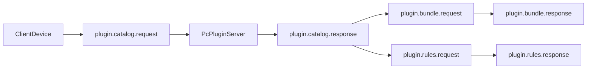
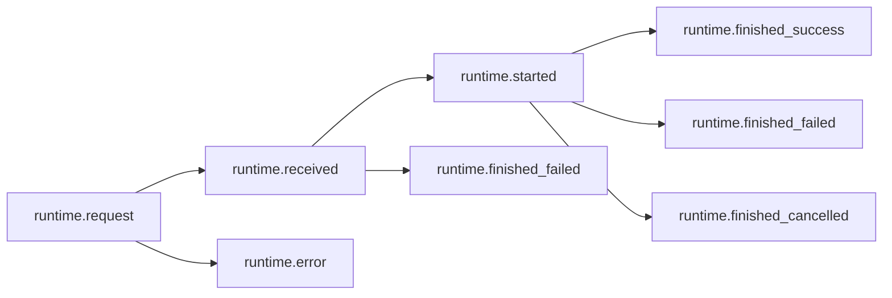
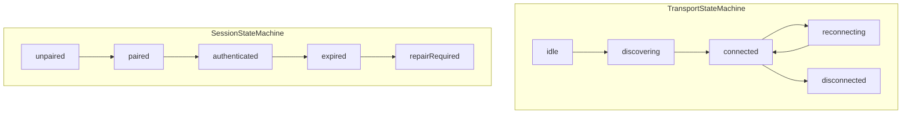

# 跨端通讯设计（重构实现）

## 目标

提供平台无关、可观测、可失败解释的跨设备通讯底层，支撑“手机触发 -> PC 执行 -> 手机回传结果”的闭环。

## 当前范围

- 仅支持 LAN 直连。
- 支持扫码、配对码、主动发现后手动确认三种配对入口。
- 支持运行时三阶段回执：`runtime.received -> runtime.started -> runtime.finished`。
- Discovery 发送链路已加入基础重试（短退避）与 socket 背压队列。
- 发送前不可达时直接失败并返回细分错误码。

## 非 MVP（明确后置）

- Relay 中继链路。
- 离线消息持久化队列。
- 强制消息签名校验（MVP 暂不启用）。

## 模块边界（代码落点）

- `@synra/transport-core`
  - `DeviceTransport` 抽象。
  - 传输层/会话层双状态机。
  - 重试与去重策略工具。
- `@synra/capacitor-electron` `device-discovery.service.ts`
  - LAN 发现、握手、会话、收发、ACK、host event 推送。
- `@synra/protocol`
  - 消息模型、错误码、`type -> payload` 映射。

## 协议与版本策略

### 版本约束

- 使用严格同主版本策略（same-major）。
- `major` 不一致时拒绝连接并返回版本不兼容错误。

### 消息头最小字段（MVP）

- `messageId`
- `sessionId`
- `timestamp`
- `type`
- `payload`

> 注：`traceId`、`ttlMs`、`retryCount` 可在后续版本加入，不阻塞 MVP。

### 字段约束（MVP）

- `messageId`：`UUID v4`。
- `sessionId`：配对会话级标识（跨重连可复用）。
- `timestamp`：Unix 毫秒时间戳（`number`）。
- `type`：使用 namespaced 命名（如 `runtime.request`）。

### messageType 枚举（当前）

执行链路：

- `runtime.request`：发起执行请求。
- `runtime.received`：目标端已接收请求。
- `runtime.started`：目标端已开始执行。
- `runtime.finished`：执行已结束。
- `runtime.error`：协议级或运行时级即时错误（无法进入正常执行闭环）。

传输链路：

- `transport.session.opened`
- `transport.session.closed`
- `transport.message.received`
- `transport.message.ack`
- `transport.error`

扩展链路：

- `custom.${string}`

### `runtime.finished` 负载约束

`runtime.finished` 必须携带 `status`，用于避免“成功/失败/取消”歧义：

- `success`
- `failed`
- `cancelled`

当 `status=failed` 时，携带简单错误对象：`{ code, message }`。

## 回执与可靠性

### 三阶段回执


- `RECEIVED`：目标端已接收并入执行流程。
- `STARTED`：目标端已开始执行插件动作。
- `FINISHED`：执行结束（成功或失败）。

### 回执与消息类型映射

- `RECEIVED` -> `runtime.received`
- `STARTED` -> `runtime.started`
- `FINISHED` -> `runtime.finished`

## 插件分发与规则同步（PC Server）

### 同步流程



### 规则

- PC 作为插件与规则配置的权威源。
- 设备每次建立会话后先拉取清单，再按需拉取包与规则。
- 规则配置携带 `ruleVersion`，设备仅做缓存和比对。
- 插件包建议返回 `checksum`，设备侧做完整性校验。

### 重试与背压（已落地）

- 仅对等待 ACK 超时执行重试（默认 3 次）。
- socket 写入走串行队列，`write()` 返回 `false` 时等待 `drain`。
- 单帧大小设上限（`MAX_FRAME_BYTES`），超限直接拒绝。

### 离线与断联处理

- 不进入离线队列，不做补偿投递。
- 发送前检测不可达时直接失败并返回细分错误（如 `DEVICE_OFFLINE`、`NOT_PAIRED`、`SESSION_EXPIRED`）。

## 安全策略（MVP）

- 会话密钥：配对码派生共享密钥（simple shared secret）。
- 鉴权失败：直接失败并提示用户手动修复，不自动重握手。
- 消息签名：MVP 不强制。
- 防重放：MVP 仅依赖 `messageId` 去重窗口。

## 错误码规范（MVP）

### 错误对象结构

```ts
type ProtocolError = {
  code: string
  message: string
}
```

### 错误域与关键细码

- `TRANSPORT_*`
  - `TRANSPORT_UNAVAILABLE`
  - `ACK_TIMEOUT`
  - `CONNECTION_LOST`
- `PAIRING_*`
  - `NOT_PAIRED`
  - `SESSION_EXPIRED`
  - `PAIRING_REQUIRED`
- `RUNTIME_*`
  - `RUNTIME_BUSY`
  - `RUNTIME_INVALID_STATE`
- `PLUGIN_*`
  - `PLUGIN_REJECTED`
  - `EXECUTION_TIMEOUT`
  - `ADAPTER_ERROR`
  - `PLUGIN_NOT_FOUND`
  - `PLUGIN_INCOMPATIBLE`
  - `PLUGIN_BUNDLE_FETCH_FAILED`
- `USER_*`
  - `USER_NOT_CONFIRMED`

> 约束：用户主动取消不走错误码，统一通过 `runtime.finished` + `status=cancelled` 表达。

## `@synra/protocol` TypeScript（当前实现）

```ts
export type ProtocolVersion = `${number}.${number}.${number}`

export type SynraMessageType =
  | 'share.detected'
  | 'action.proposed'
  | 'action.selected'
  | 'action.executing'
  | 'action.completed'
  | 'action.failed'
  | 'transport.session.opened'
  | 'transport.session.closed'
  | 'transport.message.received'
  | 'transport.message.ack'
  | 'transport.error'
  | `custom.${string}`

export type RuntimeFinishedStatus = 'success' | 'failed' | 'cancelled'

export type ProtocolErrorCode =
  | 'TRANSPORT_UNAVAILABLE'
  | 'ACK_TIMEOUT'
  | 'CONNECTION_LOST'
  | 'NOT_PAIRED'
  | 'SESSION_EXPIRED'
  | 'PAIRING_REQUIRED'
  | 'RUNTIME_BUSY'
  | 'RUNTIME_INVALID_STATE'
  | 'PLUGIN_REJECTED'
  | 'EXECUTION_TIMEOUT'
  | 'ADAPTER_ERROR'
  | 'PLUGIN_NOT_FOUND'
  | 'PLUGIN_INCOMPATIBLE'
  | 'PLUGIN_BUNDLE_FETCH_FAILED'
  | 'USER_NOT_CONFIRMED'

export interface ProtocolError {
  code: ProtocolErrorCode
  message: string
}

export type SynraCrossDeviceMessage<TType extends SynraMessageType = SynraMessageType> = {
  protocolVersion: '1.0'
  messageId: string
  sessionId: string
  traceId: string
  type: TType
  sentAt: number
  ttlMs: number
  fromDeviceId: string
  toDeviceId: string
  payload: unknown
}

export interface RuntimeRequestPayload {
  pluginId: string
  actionId: string
  input: unknown
}

export interface RuntimeReceivedPayload {
  acknowledgedAt: number
}

export interface RuntimeStartedPayload {
  startedAt: number
}

export interface RuntimeFinishedPayload {
  status: RuntimeFinishedStatus
  finishedAt: number
  result?: unknown
  error?: ProtocolError // Required when status = "failed"
}

export interface RuntimeErrorPayload {
  error: ProtocolError
}

export interface PluginCatalogRequestPayload {
  knownPlugins?: Array<{ pluginId: string; version: string }>
}

export interface PluginCatalogResponsePayload {
  plugins: Array<{
    pluginId: string
    version: string
    displayName: string
    sdkRange: string
    checksum?: string
  }>
}

export interface PluginBundleRequestPayload {
  pluginId: string
  version: string
}

export interface PluginBundleResponsePayload {
  pluginId: string
  version: string
  downloadUrl?: string
  inlineBundleBase64?: string
  checksum?: string
}

export interface PluginRulesRequestPayload {
  pluginId: string
  localRuleVersion?: number
}

export interface PluginRulesResponsePayload {
  pluginId: string
  ruleVersion: number
  enabled: boolean
  rules: Record<string, unknown>
}

export type SynraRuntimeMessage =
  | ProtocolEnvelope<'runtime.request', RuntimeRequestPayload>
  | ProtocolEnvelope<'runtime.received', RuntimeReceivedPayload>
  | ProtocolEnvelope<'runtime.started', RuntimeStartedPayload>
  | ProtocolEnvelope<'runtime.finished', RuntimeFinishedPayload>
  | ProtocolEnvelope<'runtime.error', RuntimeErrorPayload>

export type SynraPluginSyncMessage =
  | ProtocolEnvelope<'plugin.catalog.request', PluginCatalogRequestPayload>
  | ProtocolEnvelope<'plugin.catalog.response', PluginCatalogResponsePayload>
  | ProtocolEnvelope<'plugin.bundle.request', PluginBundleRequestPayload>
  | ProtocolEnvelope<'plugin.bundle.response', PluginBundleResponsePayload>
  | ProtocolEnvelope<'plugin.rules.request', PluginRulesRequestPayload>
  | ProtocolEnvelope<'plugin.rules.response', PluginRulesResponsePayload>

export type SynraProtocolMessage = SynraRuntimeMessage | SynraPluginSyncMessage
```

### 草案约束说明

- `runtime.finished` 必须包含 `status`。
- `status=failed` 时，`error` 必填。
- `status=cancelled` 时，不返回错误码。
- `runtime.error` 仅用于无法进入正常执行闭环的即时错误。

## 状态转移约束（MVP）

- `runtime.request` 后可接 `runtime.received` 或 `runtime.error`。
- `runtime.received` 后可接 `runtime.started` 或 `runtime.finished(status=failed)`。
- `runtime.started` 后必须接 `runtime.finished(status=success|failed|cancelled)`。
- `runtime.finished` 为终态，同 `messageId` 不可再次进入执行态。



## 示例报文（MVP）

```json
{
  "messageId": "550e8400-e29b-41d4-a716-446655440000",
  "sessionId": "pair-8f2a1c",
  "timestamp": 1776316800000,
  "type": "runtime.request",
  "payload": {
    "pluginId": "github-open",
    "actionId": "open-in-browser",
    "input": "imba97/smserialport"
  }
}
```

## 双状态机设计（保留）



## 可观测性事件

- 连接事件：建立、断开、重连、网络切换。
- 消息事件：发送、`RECEIVED`、`STARTED`、`FINISHED`、失败。
- 配对事件：绑定、解绑、会话失效、手动修复。
- 决策事件：插件匹配与冲突选择结果。
- 交互事件：用户确认、取消、错误提示、重试点击。

## 测试基线（当前）

- 功能闭环：移动端发送 -> PC ACK -> 事件回传 -> 前端日志更新。
- 可靠性：ACK 重试、写队列背压、超限帧防护可观察。
- 配对流程：三种入口均可完成绑定。
- 断联场景：发送前失败语义正确，UI 可解释。
