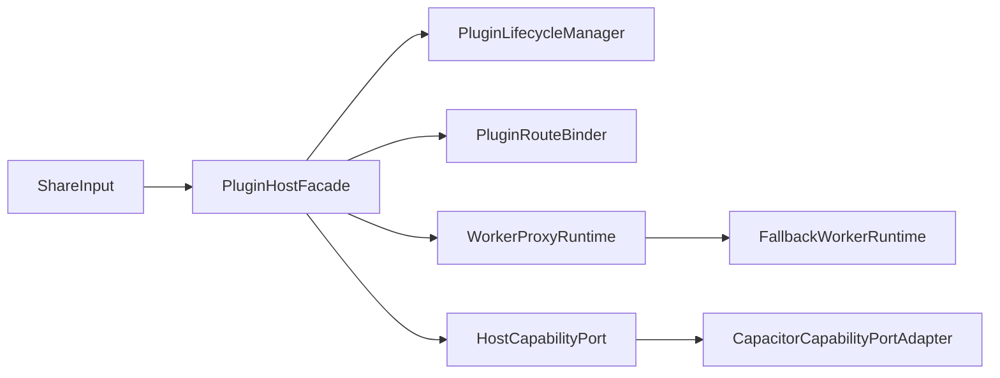

# 插件运行时设计（重构版）

## 目标（当前）

将插件系统收敛为可扩展且可隔离的执行模型：  
`输入 -> 插件宿主调度 -> Worker/回退执行 -> 跨端事件回传`。

## 设计约束（当前）

- 不内置业务动作，动作语义由插件定义。
- 不保留旧宿主重复定义，统一由宿主外观编排。
- 插件执行默认走 Worker 代理，可降级到主线程回退。
- 能力访问统一走 `HostCapabilityPort`。

## 角色划分（代码映射）

- `@synra/plugin-sdk`
  - 定义插件接口、动作模型、Worker 运行时抽象、能力端口抽象。
- `apps/frontend/src/plugins/host.ts`
  - `PluginHostFacade`、`PluginRegistry`、`PluginLifecycleManager`、`PluginRouteBinder`。
- `@synra/capacitor-electron`
  - PC 侧运行时与 discovery 传输能力。
- `apps/frontend/src/plugins/capability-port.ts`
  - Capacitor 能力适配实现（`CapacitorCapabilityPortAdapter`）。

## PC 作为插件服务端

在新架构下，PC 不仅负责执行动作，还承担插件服务端职责：

- PC 维护本机已安装插件与规则配置（作为 source of truth）。
- 其他设备连接后，通过跨端协议向 PC 拉取插件清单与规则。
- 设备侧不直接信任本地缓存，连接 PC 后以 PC 返回内容为准做同步。


## 插件契约（当前）

```ts
export interface SynraPlugin {
  id: string
  version: string
  supports(input: ShareInput): Promise<PluginMatchResult>
  buildActions(input: ShareInput): Promise<PluginAction[]>
  execute(action: PluginAction, context: ExecuteContext): Promise<SynraActionReceipt>
}

export type PluginAction = SynraActionRequest & { label: string; requiresConfirm: boolean }
```

## Worker 运行时（新增）

```ts
export type PluginWorkerTaskRequest = {
  requestId: string
  pluginId: string
  taskType: string
  payload: unknown
  timeoutMs?: number
}

export type PluginWorkerTaskResult = {
  requestId: string
  ok: boolean
  result?: unknown
  error?: { code: string; message: string; details?: unknown }
}

export interface PluginWorkerRuntime {
  executeTask(request: PluginWorkerTaskRequest): Promise<PluginWorkerTaskResult>
}
```

## 宿主与运行时流程



## 执行与回执模型（保持）

### 三阶段回执映射

- `runtime.received`：运行时已接收并准备执行。
- `runtime.started`：动作已进入插件隔离执行器。
- `runtime.finished`：执行结束，必须带 `status=success|failed|cancelled`。

### 失败与取消表达

- 执行失败：`runtime.finished` + `status=failed` + `{ code, message }`。
- 用户取消：`runtime.finished` + `status=cancelled`（不走错误码）。
- 协议级即时错误：`runtime.error` + `{ code, message }`。

### 超时规则

- 由运行时统一设置执行超时。
- 超时直接生成 `EXECUTION_TIMEOUT` 并返回 `FINISHED` 失败结果。

## 隔离模型（当前）

- 调度层统一在宿主外观层，Worker 运行时仅负责任务执行。
- 每个插件任务可由 Worker 执行，失败时回退本地执行器。
- 任务请求必须带 `requestId`，并支持超时回收。

## 能力端口接口（新增）

```ts
export interface HostCapabilityPort {
  sendCrossDeviceMessage(message: SynraCrossDeviceMessage): Promise<void>
  subscribeCrossDeviceMessage(
    type: SynraMessageType,
    handler: (message: SynraCrossDeviceMessage) => void | Promise<void>
  ): () => void | Promise<void>
}
```

### 协议对接约束

- 接收到 `runtime.request` 后，运行时必须先发送 `runtime.received`。
- 动作进入隔离执行器后，必须发送 `runtime.started`。
- 结束时必须发送 `runtime.finished`，且带 `status`。
- 无法进入执行闭环的异常，发送 `runtime.error`。
- 设备请求插件清单/规则时，PC 必须返回当前已安装版本与规则版本。
- 设备请求插件包时，PC 返回可校验的包引用（`checksum`）。

### 插件同步约束（当前）

- 不保留旧接口双写，宿主与协议一次性切换到新事件语义。
- 前端插件页不直接处理原生消息，统一消费 store/能力端口事件。

## 错误语义（与传输层对齐）

- 传输前失败：`DEVICE_OFFLINE` / `NOT_PAIRED` / `SESSION_EXPIRED`。
- 执行失败：`EXECUTION_TIMEOUT` / `PLUGIN_REJECTED` / `ADAPTER_ERROR`。
- 运行时状态异常：`RUNTIME_INVALID_STATE` / `RUNTIME_BUSY`。
- 所有错误都要求可直接映射到手机端可读提示。

## 安全与边界

- 插件不可直接访问 Electron 原生对象。
- 系统能力必须经 `action adapter` 白名单。
- Opaque payload 在进入 adapter 前必须经过运行时校验与净化。

## 示例：Github 打开插件

- 输入：`imba97/smserialport` 或 `https://github.com/imba97/smserialport`
- 处理：插件识别并标准化 URL，产出候选动作
- 交互：用户确认后触发执行
- 结果：PC 打开浏览器并回传 `FINISHED`
