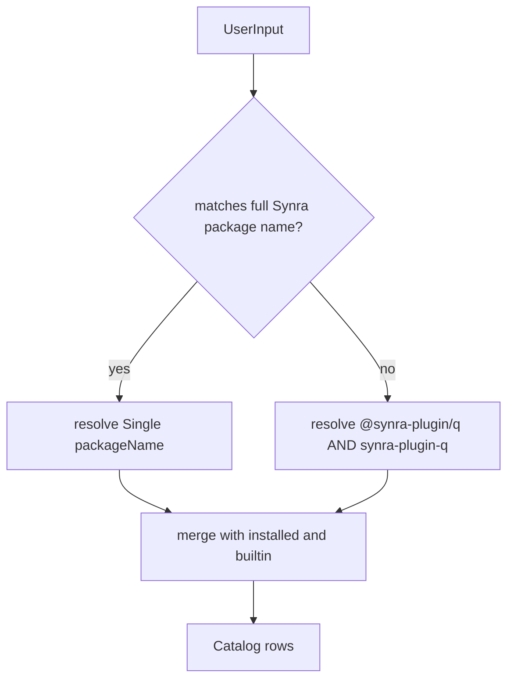
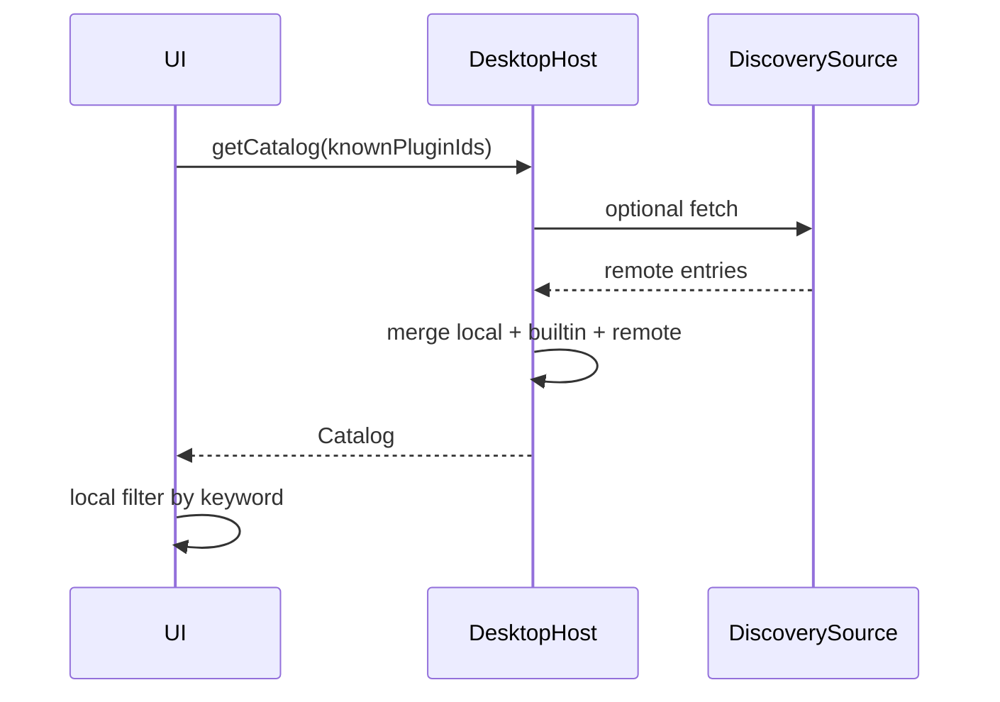

# 发现与目录、搜索

## 目标

为用户提供**可安装的插件集合视图**：条目包含 `pluginId`、展示名、版本、图标、默认页、`status`（可用 / 已安装）、可选 `packageName`（安装时用）。

数据来源通常是**多源合并**，而非单一 registry 一次性枚举。

## 数据源模型（实现须支持合并）

| 来源       | 作用                                                                               |
| ---------- | ---------------------------------------------------------------------------------- |
| 本地已安装 | 来自 install 记录，表示已落盘且可激活的插件。                                      |
| 内建/预置  | 随应用打包的插件元数据，可标 `builtin`。                                           |
| 远程可发现 | 通过**受控**端点拉取「可装列表」；或从 registry 元数据按需拉取（见下方可选方案）。 |

合并规则：同一 `pluginId` 以**最新业务规则**决占先（常见：已装记录覆盖仅元数据条目，以显示正确版本与状态）。

## 增量拉取（`knownPluginIds`）

为减少流量，目录 API 可接受客户端已知的 `pluginId` 集合，服务端/宿主**滤除**这些 id，只返回**新**或**有更新**的条目。客户端在冷启动后、或轮询时携带上次的 id 集合即可。

## 搜索与过滤（UI 契约）

建议拆为两层，由产品选开何者或同时开：

1. **本地过滤**：对当前已加载的 `Catalog` 做关键词子串匹配（`displayName`、`pluginId`、`version` 等）。
2. **远程搜索**：将 `q`、作用域、分页参数发给**发现服务**或 **registry search**（见可选方案），结果与本地已装状态再合并。

实现上为 `search` 与 `refreshCatalog` 定义独立方法，避免把「UI 搜索条」与「发现源」绑死。

## 包名识别与关键词双查

在发起 **registry 元数据请求**或**发现服务查询**之前，对用户输入做一次**轻量分类**（包名规则与 [01-package-and-manifest.md](./01-package-and-manifest.md) 一致）：

| 输入类型                                                        | 行为                                                                                                                                                                                                |
| --------------------------------------------------------------- | --------------------------------------------------------------------------------------------------------------------------------------------------------------------------------------------------- |
| **合法全量包名**（`@synra-plugin/<id>` 或 `synra-plugin-<id>`） | **不**做关键词展开；以该字符串作为 **唯一** `packageName` 拉取元数据 / 解析安装 /（若接 npm search）以全名搜索。                                                                                    |
| **否则**视为 **插件 id 关键词** `q`（如 `chat`）                | 自动派生**两个候选**并**分别**请求：`@synra-plugin/{q}` 与 `synra-plugin-{q}`；将**非 404** 或**有元数据**的结果**合并、按 `pluginId` 去重**后再交给 UI。一侧不存在时可静默省略，避免打断输入体验。 |

可与上方的「本地过滤」叠加：远程合并后的列表仍可按搜索框子串继续收窄。

## 与安装流程的衔接

用户从某条 `Catalog` 行发起安装时，必须提供至少：

- `packageName`（与 `pluginId` 可互推，但显式 `packageName` 更利于直调 registry）
- 目标 `version` 或 `dist-tag` 解析策略

安装失败时该条回写为 `failed`，不进入激活。

## 可选方案：可发现列表从哪来

| 方案                       | 说明                                                                                 | 适用                           |
| -------------------------- | ------------------------------------------------------------------------------------ | ------------------------------ |
| A. 精选 JSON / 小服务      | 团队维护 `https://.../plugin-index.json`，条项含 `packageName`、推荐版本、展示信息。 | 强控、少依赖 npm 搜索。        |
| B. npm search / 作用域 API | 用公开或私有 registry 的搜索与元数据端点。                                           | 与生态结合、需限流与结果整形。 |
| C. 混合                    | 默认走 A，用户可切到 B 或手输 `packageName@version`。                                | 平衡安全与发现面。             |

实现时把**发现**与**安装**解耦：发现只负责 `Catalog` 行，安装只认 `packageName` + 版本策略 + 白名单 registry。

## 数据流（目标）

