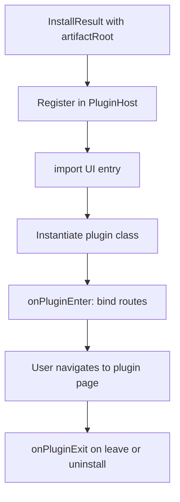

# 激活与运行时

## 目标

安装完成后，将插件 UI 包挂入宿主应用：**动态加载入口模块**、**注册路由**、在适当时机执行 **plugin-sdk 生命周期**（进入/离开插件），与动作执行、事件等能力通过 [plugin-sdk](../plugin-chat-sdk/sdk-lifecycle-and-routing.md) 统一。

## 注册

- 用 `pluginId` 在**单例注册表**中避免重复；同 id 新版本可执行**先 unregister 再 register**或原地替换策略（需定义）。
- 元数据来自 manifest：`title`、`defaultPage`、`icon`、`builtin` 等，供侧栏与 URL 生成使用。

## 动态 `import()`（渲染进程 / UI）

- 入口路径由 `artifactRoot` + 约定相对路径（或由 manifest `entries.ui` 给出），拼接成可对浏览器/Electron 加载的 URL（如 `file:` + encode）。
- **仅加载构建产物**：应为 **`vp pack`（或等价）产出的 ESM**，例如 `dist/ui/index.mjs`；使用 **原生动态 `import()`**，**不在** Chromium/WebView 内使用 [importx](https://github.com/antfu-collective/importx)（其为 Node/工具链场景的 TS 运行时加载统一层）。
- **与宿主共用的依赖**（`vue`、`@synra/hooks` 等）在**典型**产品形态下于构建期做 **`external`**，由宿主/壳在运行时用 **同一份** 解析目标提供（import map 等）——**尤其**在 [手机同步](./05-sync-to-mobile.md) 后**没有**可随包复制的 `node_modules`；**仅插件自用的**依赖可打进 `dist/ui`。
- 默认导出应为插件类构造器；宿主 `new` 后调用 SDK 约定接口注册页面与子路由。

## Host 入口加载（Node）与 importx

- **`synra.entries.host`**（或等价路径）由 **Electron 主进程 / Node 宿主**加载。
- **生产**：优先对已解压目录下的 **`dist/host/index.mjs`**（或 manifest 指定文件）使用 **原生 `import()`**（冷启动更省）。
- **开发或必须从磁盘加载 `.ts` 源码**：用 [importx](https://github.com/antfu-collective/importx) 做运行时 TS/ESM 统一加载时，**应**经集中封装的 **Synra 插件 importx 加载器**（单例 `importx` 模块 + `loadSynraPluginModule(layer, …)` 形态），见 [08-plugin-import-loader.md](./08-plugin-import-loader.md)；不要散落多处 `import('importx')`。
- **分层**：host 侧可使用 **完整 npm 依赖**；ui 在渲染进程仍只走**原生** `import()`，见上节与 [08](./08-plugin-import-loader.md)；子包职责见 [07-plugin-runtime-layers.md](./07-plugin-runtime-layers.md)。

## 路由

- 约定形如 `/plugin-<pluginId>/<pageKey>` 或与产品统一的前缀；与 [plugin-chat-sdk](../plugin-chat-sdk/first-plugin-chat.md) 中首插件策略一致即可，全项目只持一套规范。

## 生命周期

- 进入插件页：执行 `onPluginEnter`（或等价），完成子路由注册、资源预取等。
- 离开/卸载：执行 `onPluginExit`，撤销动态路由、释放监听器。

## 与「仅已装」态的依赖

未**激活**的插件可占磁盘但不可从 UI 进入；**激活**可紧接在**安装**后，或首次打开时懒执行，二选一时在实现中统一并写清。

## 数据流（目标）

## 与跨端一致

手机端在**成功落盘并激活**后，应能走**相同或子集**的注册与路由规则，使 `pluginId` + `pageKey` 在双端可理解；若手机仅支持部分能力，在 manifest 中增加 `synra.capabilities` 由宿主在激活时过滤未实现 API（可选扩展）。
