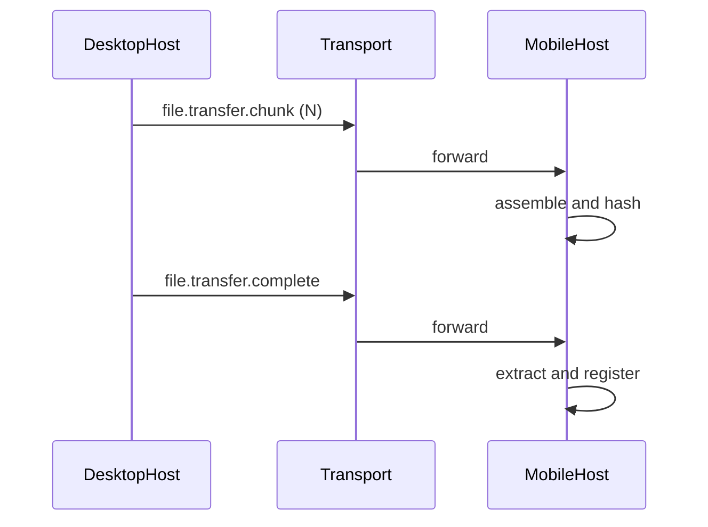

# 手机同步

## 定义

在**已建立**与对端设备的受信连接后，将**与桌面已安装插件相同**的发布物（推荐为**同一份 `package.tgz` 或解压后重打的 tar**）推送到手机，手机端**重组、校验、落盘、再激活注册**。

这不是应用商店安装，而是**包产物的受控同步**。

## 同步物与「不」同步物（设计推论）

- 传到手机、用于激活的，是 **发布包体**里以 **`dist/**` 为主** 的内容（与 tarball 策略一致），**不**把桌面插件目录下的整棵 **`node_modules`** 随包复制到手机，也**不**在手机上对插件再跑一遍 `npm install` 来补依赖（产品默认可行、体积与端能力均不允许依赖该路径）。
- 因此，**与壳/宿主已经提供的** 运行时能力（如 `vue`、`@synra/hooks`、未来组件库）在插件 **UI 构建**上**必须**走 **peer + 构建期 `external`**，由 **手机壳与主应用同一套** ESM / import map / 联邦 提供；**不能**依赖「手机磁盘上存在与桌面相同的 `node_modules` 树」。
- **仅插件使用、宿主不提供的** 小库（如 `dayjs`）若也 **不能** 指望手机另装 `node_modules`，则必须 **打进 `dist/ui`（不 external）**；否则运行时不存在第二来源。

上述划分与 [04-activate-and-runtime.md](./04-activate-and-runtime.md) 中「与宿主共用的依赖 → 构建期 **external**」一致：**移动端**没有可随包复制的整棵 `node_modules`，因而从结论上**强化**「大库共壳、小库打进 dist」。

## 模块边界

- **设备连接 / 传输**层：只负责将**已分块**的字节与**元数据**（`pluginId`、`version`、分片索引）从 A 设备送到 B 设备，不解析包内业务规则。与 monorepo 内 `capacitor-device-connection` 等桥接一致时，保持「连接、发消息、收消息」即可。
- **插件系统**层：在收到 `complete` 后，对**整包**做 hash/签名校验、解压、写 install 记录、调用与 [04-activate-and-runtime.md](./04-activate-and-runtime.md) 对齐的激活。

## 触发

- 显式用户操作：在已选设备上「同步此插件」。
- 隐式：若产品需要，可在成功连接后按策略拉取 catalog 差异后自动推（需防刷与确认策略）。

## 实现对照（可选读）

与 [file-transfer/02-hooks-and-plugin-sdk.md](../file-transfer/02-hooks-and-plugin-sdk.md) 一致：**`@synra/protocol`** 提供 `iteratePluginBundleChunks`、`PluginBundleTransferAssembly`、`fileTransferChunkCount` 等；宿主或工具链若发送裸逻辑 `event`，可用 **`@synra/hooks`** 的 **`useFileTransfer`**（内部基于 `useSynraEnvelope`）；插件 UI 侧用 **`useSynraPluginEnvelope`** + 逻辑名 **`file.transfer.*`**（线上带 **`_plugin.{slug}.`** 前缀）。

## 桥接 / 宿主侧（发送端）建议流程

1. 根据 `pluginId` 查本地 install 记录，得到 `artifactRoot` 与 `version`。
2. 定位**要传输的位**（实现可二选一并定稿）：
   - **A.** 直接读 `artifactRoot` 下保留的 `package.tgz`（与从 registry 下载的相同位流，手机可同验 `shasum`）；
   - **B.** 无 tgz 时从目录**重打** tar 再传（需与接收端约定 hash 算法与内容根）。
3. 分片：将 buffer 按固定大小（如 64KiB）切块；若允许乱序到达，每块带 `chunkIndex` / `totalChunks`。
4. 通过连接服务发**数据面**消息：事件名为 **`file.transfer.request` / `file.transfer.chunk` / `file.transfer.complete`**（见 `packages/protocol` 与 [file-transfer/04-protocol-events-and-payload.md](../file-transfer/04-protocol-events-and-payload.md)），payload 含 **`transferId`**、`kind: 'plugin-bundle'`、`pluginId`、`version`、**`chunkBase64`**（默认）及分片元信息。
5. `complete` 后发送端可得到 `transmittedChunks` 等统计，供 UI 与可观测性使用。

## 接收端（手机）必做

1. **Assembly buffer**：按 `pluginId` + `version` 维度的收包状态机，收满 `totalChunks` 或流式写盘（推荐写临时文件减少内存）。
2. **Checksum**：与桌面同一算法校验 tarball（或与 manifest 声明的 `shasum` 比）；失败则删临时文件、向用户报**不激活**。
3. **落盘**：解到应用可写目录（见下「存储位置」），写**与桌面同构**的 install 记录（可带 `source: 'sync'` 与 `sourceDeviceId`）。
4. **激活**：与 [04-activate-and-runtime.md](./04-activate-and-runtime.md) 相同或子集；若手机只读 `dist` 不跑 node 侧 native 依赖，应在规范中限制包内容或做能力声明。

## 失败与重试

- 分片丢、序错、timeout：可要求**同 version 全量重传**；实现上为每轮传参 `syncSessionId` 避免块混用。
- 用户取消或会话中途终止：发送 **`file.transfer.abort`**（见 [file-transfer/04-protocol-events-and-payload.md](../file-transfer/04-protocol-events-and-payload.md)）。
- 空间不足、签名校验失败：不进入激活，保留上**一版**可回滚（见 [plugin-page-loading-and-mobile-install.md](../plugin-chat-sdk/plugin-page-loading-and-mobile-install.md) 中的回滚建议）。

## 可选方案：手机落盘位置

| 方案               | 说明                                                                       |
| ------------------ | -------------------------------------------------------------------------- |
| Capacitor 可写目录 | 经 FileSystem/Data 或自定义 native 暴露的 `basePath`，大文件与解压更自然。 |
| 纯 Web 存储        | 受 quota 与 API 限制，大 tarball 不现实，**不推荐**作为整包主路径。        |

**推荐**：在 device 或 file 类 Capacitor 插件中提供「插件缓存根」，插件系统只依赖抽象路径接口。

## 数据流（目标）

## 集群扩展

多成员权威目录与 bundle 请求见 [plugin-sync-and-runtime-routing.md](../device-cluster-architecture/plugin-sync-and-runtime-routing.md)；与本文**点对点推**可共享**同一条** `package` 校验与版本比较规则，在集群宿主持有 `PluginCatalogAuthority` 时，手机应只消费**经许可的**版本与来源。
