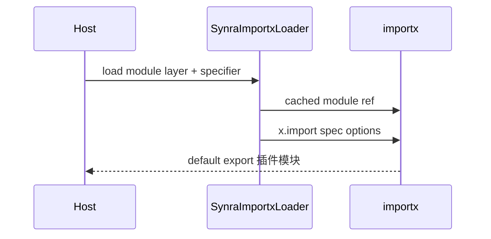

# 插件 importx 加载器（规范）

实现时在 **Node 宿主**（如 Electron 主进程）内提供**薄封装**：[importx](https://github.com/antfu-collective/importx) 用于在运行时加载 TypeScript/ESM 的插件子入口。本文约定 API 形态与**全局单例**用法；**不**在 Chromium/WebView 中直接使用 importx，渲染侧见下文。

## 为何需要封装

- importx 的 `import()` 需要**稳定的 `parentURL`** 与可组合的 `cache` / `loader` / `listDependencies` 等；宿主集中封装可避免在多处重复 `import('importx')` 与缺省参数不一致。
- 通过第一个参数 `layer: 'ui' | 'host' | 'worker'` 表达「当前加载的是哪类子包」，便于统一日志、可观测与**按层**调整默认 `importx` 选项（留扩展点，初版可全层统一默认值）。

## 全局只用一个 `importx` 模块实例

与 importx 文档一致，先**动态导入**并**缓存** Promise，整个进程内复用**同一个**已解析的模块对象，再复用其 `import` 方法（文档里常写作 `x.import`）：

```ts
// Pseudocode: once per process
const importx = await import('importx')
// all subsequent loads use the same `importx` value
const mod = await importx.import(pathToFile, {
  parentURL, // see below; required in importx API
  cache: null,
  listDependencies: false,
  loader: 'auto'
  // other ImportxOptions as in importx README
})
```

**不得**在每次 `load*()` 时重新无缓存地 `import('importx')` 以外层逻辑展开新实例的意图；**应**有且仅有一个懒加载的 `Promise<typeof import('importx')>`（或等价的模块级变量），首次 await 后全程复用。

## `loadSynraPluginModule`（或等价命名）契约

| 形参        | 含义                                                                                                                                                                     |
| ----------- | ------------------------------------------------------------------------------------------------------------------------------------------------------------------------ |
| `layer`     | `'ui'` / `'host'` / `'worker'`，**仅**选择语义与（可选的）每类默认 `importx` 选项，**不**替代 `specifier`；子入口路径由宿主根据 `artifactRoot` 与 `synra.entries` 拼出。 |
| `specifier` | 传给 `importx.import` 的模块路径/URL 字符串，一般为某个 `dist/<layer>/index.mjs` 的绝对路径，或开发时指向 `src/.../index.ts`（由 importx 的 loader 处理）。              |
| `options`   | 透传 importx 的**其余** `ImportxOptions`（如 `loader`、`cache`、`listDependencies`），**并与**下文的 `parentURL` 规则合并。                                              |

- **`parentURL`（importx 必传项）**
  - 默认使用**加载器实现文件**自身的 `import.meta.url`（即「谁在做 dynamic import」），与 importx 文档「usually `import.meta.url` of the module you are doing the importing」一致。
  - 若插件入口内部使用**相对**于插件根目录的解析，宿主可**显式**将 `parentURL` 改为插件包根或 `package/dist` 的 `file:` URL。

其余选项以 [importx `ImportxOptions`](https://github.com/antfu-collective/importx) 为准，例如 `loader: 'auto'`、`cache: null`、`listDependencies: false` 的默认值与 loader 表。

## 与分层边界（07）的对应

| `layer`  | 典型可加载物                                 | 说明                                                                                                                                                                                              |
| -------- | -------------------------------------------- | ------------------------------------------------------------------------------------------------------------------------------------------------------------------------------------------------- |
| `host`   | `dist/host/index.mjs` 或 `src/host/index.ts` | Node 主进程；插件可使用完整 npm/Node API。                                                                                                                                                        |
| `worker` | `dist/worker/index.mjs` 等                   | 由**宿主**在选定执行环境后加载；若在 Web Worker 中，**禁止**在插件侧使用 Node 专用包（见 [07](./07-plugin-runtime-layers.md)）。importx 只解决「在**当前 Node/TS 上下文**中如何把文件变成模块」。 |
| `ui`     | `dist/ui/index.mjs` 等                       | 仅在 **Node 内** 需要**用 importx** 做诊断、预检、同构工具链时经本加载器；**用户界面实际运行时**在渲染进程仍用 **Vite/浏览器原生 `import()` 加载 ESM 产物**（不经过 importx）。                   |

**`shared` 不**作为本加载器的第一类 `layer`：`shared` 为被 `host`/`ui`/`worker` 引用的模块，随正常 bundler/import 图解析，无需单独经「`layer: 'shared'`」的顶层入口；若将来需要，可再扩展约定。

## 与解压目录的辅助方法（可选）

若 tarball 解压在 `<artifactRoot>` 下存在标准布局 `package/dist/<layer>/index.mjs`（与 [@synra-plugin/chat](https://github.com/synra-app/synra-plugin-chat) 等一致），可约定辅助函数，例如 `synraPackagedLayerEntryPath(artifactRoot, layer)` 返回**绝对文件路径**字符串，再作为 `specifier` 传入上述 `load*`，避免各处手写 `join`。

## 数据流（Node 主进程）



## 实施顺序

本封装应在「主进程能拿到 `artifactRoot` + 解析 `synra.entries`」之后实现，并与 [04-activate-and-runtime.md](./04-activate-and-runtime.md) 的激活流程对齐；详见 [06-implementation-phases.md](./06-implementation-phases.md)。
